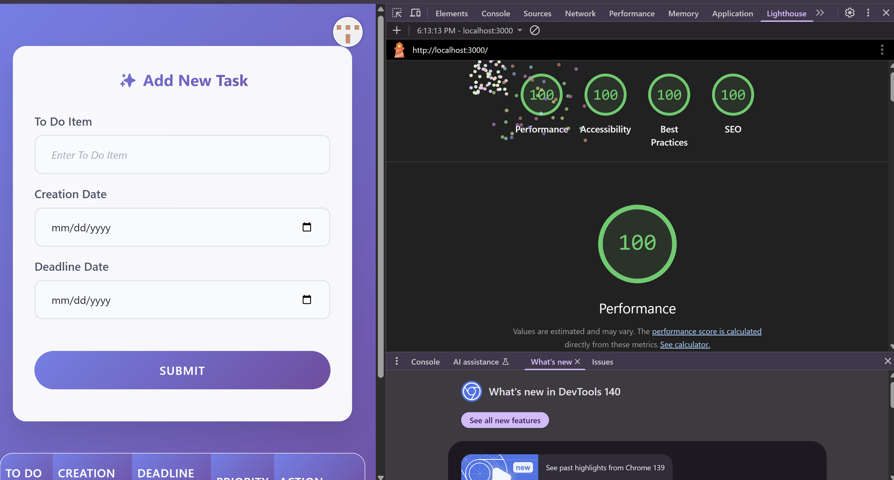

Assignment 3 - Persistence: Two-tier Web Application with Database, Express server, and CSS template
===
## To Do List Application

Render (or alternative server) link e.g. https://a3-shawnpatel.onrender.com/

### Goal of the Application: 
- The goal of the application is to provide an authenticated To Do management system where each user can securely log in with GitHub, create, view, modify, and delete their own tasks. Each task includes a name, creation date, and deadline date, and the application automatically calculates and displays a priority level for each entry. 
### Challenges Faced: 
- Integrating GitHub OAuth authentication and ensuring that each user only sees their own data. 
- Dynamically updating the task table after form submissions without requiring a full page reload. 
- Handling date inputs and calculating priority levels automatically based on creation and deadline dates. 
- Ensuring proper validation and UX for editing and deleting tasks while maintaining responsive styling.
### Authentication Strategy:
- GitHub OAuth was chosen because it provides secure, standardized authentication, and allows for easy association of tasks with individual user accounts. Using GitHub also simplifies user management since no separate username/password system is required. 
### CSS Framework Used:
- Bootstrap 5 was used to quickly build a responsive and visually appealing interface with minimal custom CSS. 
- Custom CSS modifications include: Styling the login container with a video background overlay. 
- Custom button styles for GitHub login. Table and form styling to match the app theme and improve readability. 
- Profile dropdown hover and icon adjustments. 
### Express Middleware Packages and Functions Used:
- express.json() – Parses incoming JSON payloads in request bodies so req.body is available.
- express.urlencoded({ extended: true }) – Parses URL-encoded form data from HTML forms.
- express.static() – Serves static files like CSS, JS, and images from the public folder.
- express-session – Manages user sessions, keeping users logged in across requests.
- passport – Handles authentication strategies and manages user login state.
- passport-github2 – Implements GitHub OAuth strategy for logging in with GitHub accounts.
- Custom ensureAuthenticated function – Protects routes by checking if the user is logged in; redirects to /login if not.
- Route-specific middleware (e.g., in /submit, /update, /delete) – Ensures each operation is performed only for the authenticated user and automatically associates data with that user.
- Error handling within routes – Each route includes error handling to respond with clear messages for missing data, unauthorized access, or internal server errors.

## Baseline Requirement - Server (completed ✅)(15 pts):
- Created the server using Express as required for this assignment. The server can be found in server.js

## Baseline Requirement - Results (completed ✅)(15 pts):
- All data entered by user is shown under the form in a table. This is where they will see all the to-do items they have submitted through the form. This is specific for that user only and in the top right corner they will see their username and a logout option as well (GitHub authentication).

## Baseline Requirement - Form/Entry (completed ✅)(15 pts):
- There is a form functionality where users are allowed to add new to-do items and once added, they can modify or delete them as well. These entries are specific to their account and it is connected with their GitHub account.

## Baseline Requirement - Form/Entry (completed ✅)(15 pts):
- The data storage is persistent across server sessions using MongoDB. All to-do items will persist even after logging out/closing window and when re-logging back in, that data will be there for each user.

## Baseline Requirement - CSS Framework/Template (completed ✅)(10 pts):
- I utilized Bootstrap as my CSS Framework for both the login page and the main page of my website. However, I did tweek some of the default styles from Bootstrap to better fit my vision of the design for the website (Bootstrap is default framework but as professor said we can make some changes if we want).

## Baseline Requirement - HTML (completed ✅)(5 pts):
- I used a variety of HTML tags such as text, date, button etc. and also used /api/me that fetches the currently authenticated user and the user’s GitHub username and avatar are displayed in the profile dropdown. The To Do table dynamically displays only that user’s tasks, so each user sees their own data, not data from other users. 

## Baseline Requirement - General (completed ✅)(10 pts):  
- My webpage achieved at least 90% on the `Performance`, `Best Practices`, `Accessibility`, and `SEO` tests using Google [Lighthouse](https://developers.google.com/web/tools/lighthouse) (don't worry about the PWA test, and don't worry about scores for mobile devices). Proof will be below.

## Technical Achievement - OAuth Implementation (completed ✅)(10 pts):
- I implemented OAuth for this assignment using the passport.js library via the GitHub strategy. My website uses GitHub authentication and each user sees only data pertaining to their account (data they submitted through the to-do form).

## Technical Achievement - 100 % Google Lighthouse Tests (completed ✅)(5 pts):
- My webpage got 100% (not 98%, not 99%, but 100%) in all four lighthouse tests required for this assignment.
- 
  
